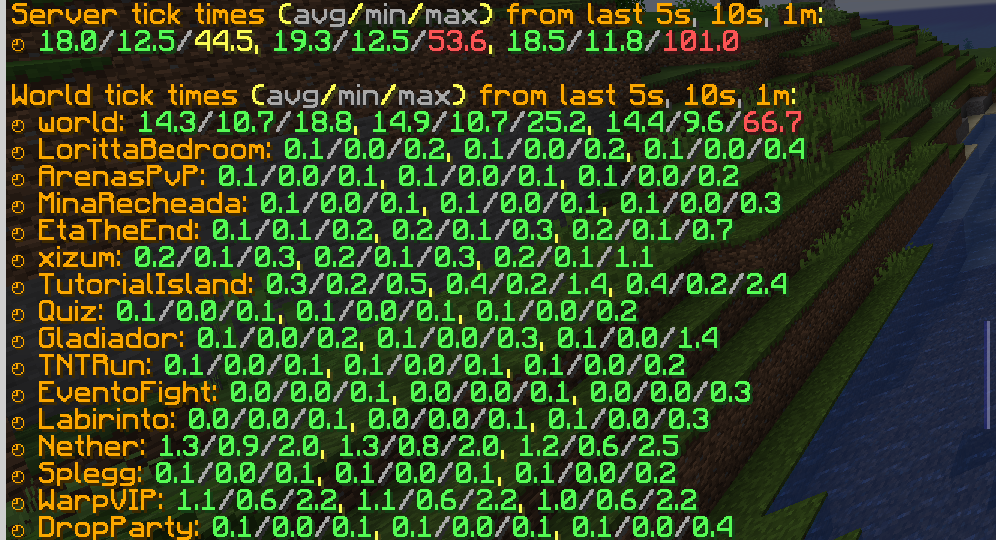

<h1 align="center">✨ SparklyPaper ✨</h1>

SparklyPower's Paper fork, with a mix of weird & crazy patches from other forks!

While our fork is mostly cherry-picked patches from other forks, we do have some handmade patches too to add and optimize some of the things that we have in our server!

## Features

This does not include all patches included in SparklyPaper, only the patches exclusive to SparklyPaper! To see all patches, check out the ["patches" directory](patches).

SparklyPaper's config file is `sparklypaper.yml`, the file is, by default, placed on the root of your server.

* Configurable Farm Land moisture tick rate when the block is already moisturised
  * The `isNearWater` check is costly, especially if you have a lot of farm lands. If the block is already moistured, we can change the tick rate of it to avoid these expensive `isNearWater` checks.
  * (Incompatible with the Blazingly Simple Farm Checks feature)
* Skip `distanceToSqr` call in `ServerEntity#sendChanges` if the delta movement hasn't changed
  * The `distanceToSqr` call is a bit expensive, so avoiding it is pretty nice, around ~15% calls are skipped with this check. Currently, we only check if both Vec3 objects have the same identity, that means, if they are literally the same object. (that works because Minecraft's code reuses the Vec3 object when caching the current delta movement)
* Skip `MapItem#update()` if the map does not have the default `CraftMapRenderer` present
  * By default, maps, even those with custom renderers, fetch the world data to update the map data. With this change, "image in map" maps that have removed the default `CraftMapRenderer` can avoid these hefty updates, without requiring the map to be locked, which some old map plugins may not do.
  * This has the disadvantage that the vanilla map data will never be updated while the CraftMapRenderer is not present, so if you readd the default renderer, the server will need to update the map data, but that's not a huuuge problem, after all, it is a very rare circumstance that you may need the map data to always be up-to-date when you have a custom renderer on the map.
  * But still, if you made your own custom "image on map" plugin, don't forget to `mapView.isLocked = true` to get the same performance benefits in vanilla Paper!
* Fix concurrency issues when using `imageToBytes` in multiple threads
  * Useful if one of your plugins is parallelizng map creation on server startup
* Optimize `ServerStatsCounter`'s dirty set
  * Instead of using Java's HashSet, we will use fastutil's `ObjectOpenHashSet`, which has better performance
  * While this seems stupid, awardStat was using around ~0.14% when adding to the `HashSet`, and that's not good
  * We also optimized the `getDirty` calls. I mean, the *only* `getDirty` call. Because the map was only retrieved once, we don't actually need to create a copy of the map just to iterate it, we can just access it directly and clear it manually after use.
* ~~Avoid unnecessary `ItemFrame#getItem()` calls~~
  * ~~When ticking an item frame, on each tick, it checks if the item on the item frame is a map and, if it is, it adds the map to be carried by the entity player~~
  * ~~However, the `getItem()` call is a bit expensive, especially because this is only really used if the item in the item frame is a map~~
  * ~~We can avoid this call by checking if the `cachedMapId` is not null, if it is, then we get the item in the item frame, if not, then we ignore the `getItem()` call.~~
  * Replaced by [Warriorrrr's "Rewrite framed map tracker ticking" patch (Paper #9605)](https://github.com/PaperMC/Paper/pull/9605)
* Optimize `EntityScheduler`'s `executeTick`
  * On each tick, Paper runs `EntityScheduler`'s `executeTick` of each entity. This is a bit expensive, due to `ArrayDeque`'s `size()` call because it ain't a simple "get the current queue size" function, due to the thread checks, and because it needs to iterate all server entities to tick them.
  * To avoid those hefty calls, instead of iterating all entities in all worlds, we use a set to track which entities have scheduled tasks that we need to tick. When a task is scheduled, we add the entity to the set, when all entity tasks are executed, the entity is removed from the set. We don't need to care about entities that do not have any tasks scheduled, even if the scheduler has a `tickCount`, because `tickCount` is relative and not bound to the server's current tick, so it doesn't matter if we don't increase it.
  * Most entities won't have any scheduled tasks, so this is a nice performance bonus, even if you have plugins that do use the entity scheduler because, for 99,99% of use cases, you aren't going to create tasks for all entities in your server. With this change, the `executeTick` loop in `tickChildren` CPU % usage drops from 7.60% to 0.00% (!!!) in a server with ~15k entities! Sweet!
    * Yeah, I know... "but you are cheating! the loop doesn't show up in the profiler because you replaced the loop with a for each!" and you are right! Here's a comparison of the `tickChildren` function CPU usage % between vanilla Paper and SparklyPaper, removing all other functions from the profiler result: 7.70% vs 0.02% (wow, such improvement, low mspt)
  * Of course, this doesn't mean that `ArrayDeque#size()` is slow! It is mostly that because the `executeTick` function is called each tick for each entity, it would be better for us to avoid as many useless calls as possible.
* Blazingly Simple Farm Checks
  * Changes Minecraft's farm checks for crops, stem blocks, and farm lands to be simpler and less resource intensive
  * If a farm land is moisturised, the farm land won't check if there's water nearby to avoid intensive block checks. Now, instead of the farm land checking for moisture, the crops themselves will check when attempting to grow, this way, farms with fully grown crops won't cause lag.
  * The growth speed of crops and stems are now fixed based on if the block below them is moist or not, instead of doing vanilla's behavior of "check all blocks nearby to see if at least one of them is moist" and "if the blocks nearby are of the same time, make them grow slower".
    * In my opinion: Who cares about the vanilla behavior lol, most players only care about farm land + crop = crop go brrrr
  * Another optimization is that crop behavior can be changed to skip from age zero to the last age directly, while still keeping the original growth duration of the crop. This way, useless block updates due to crop growth can be avoided!
* Lazily create `LootContext` for criterions
  * For each player on each tick, enter block triggers are invoked, and these create loot contexts that are promptly thrown away since the trigger doesn't pass the predicate.
  * To avoid this, we now lazily create the LootContext if the criterion passes the predicate AND if any of the listener triggers require a loot context instance.
* Spooky month optimizations
  * The quintessential patch that other performance forks also have for... some reason??? I thought that this optimization was too funny to not do it in SparklyPaper.
  * Caches when Bat's spooky season starts and ends, and when Skeleton and Zombies halloween starts and ends. The epoch is updated every 90 days. If your server is running for 90+ days straight without restarts, congratulations!
  * Avoids unnecessary date checks, even tho that this shouldn't really improve performance that much... unless you have a lot of bats/zombies/skeletons spawning.
* Check how much MSPT (milliseconds per tick) each world is using in `/mspt`
  * Useful to figure out which worlds are lagging your server.

* Parallel World Ticking
  * "mom can we have folia?" "we already have folia at home" folia at home: [Parallel World Ticking](docs/PARALLEL_WORLD_TICKING.md)

We don't cherry-pick *everything* from other forks, only patches that I can see and think "yeah, I can see how this would improve performance" or patches that target specific performance/feature pain points in our server are cherry-picked! In fact, some patches that are used in other forks [may be actually borked](docs/BORKED_PATCHES.md)...

## Support

Because this is a fork made for SparklyPower, we won't give support for any issues that may happen in your server when using SparklyPaper. We know that SparklyPaper may break some plugins, but unless we use these plugins on SparklyPower, we won't go out of our way to fix it!

If you only care about some of the patches included in SparklyPaper, it is better for you to [create your own fork](https://github.com/PaperMC/paperweight-examples) and cherry-pick the patches, this way you have full control of what patches you want to use in your server, and even create your own changes!

## Downloads

You can download SparklyPaper's Paperclip JAR [here](https://github.com/SparklyPower/SparklyPaper/actions/workflows/build.yml). Click on a workflow run, scroll down to the Artifacts, and download!